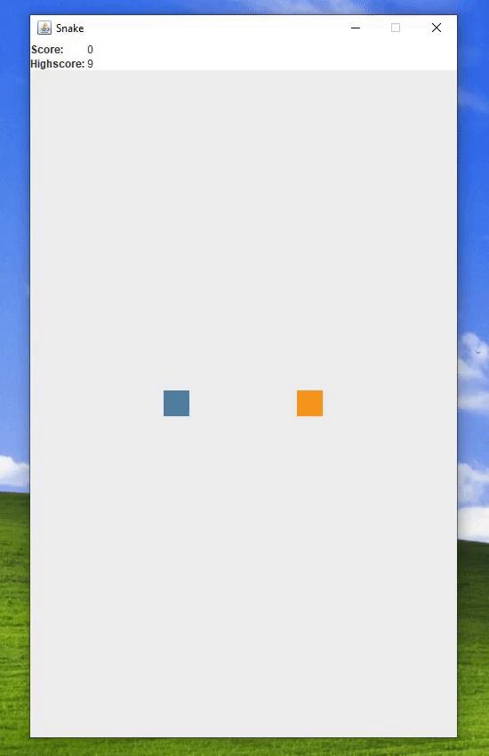

# desktop-snake-clone 

> Desktop snake game clone.

    

## About
This repo showcases my [Snake game](https://en.wikipedia.org/wiki/Snake_(video_game_genre)) implementation I did as one 
of my Java class assignments.

## Gameplay
- The player controls the snake's direction with **arrow keys**, with goal of collecting as much food as possible. 
- As the snake eats food, it grows - making the game progressively more difficult.
- When the snake crashes (by running into itself or the gameboard's wall) the game ends, giving the player option to play again or quit.
- The game keeps track of the player's highscore by saving it to a **binary** file. 

## Technology
It's build in the Swing framework, and is based on MVC design pattern to 
ensure separation between the game's GUI and internal logic modules.
The communication between the two is done through events and event listeners.